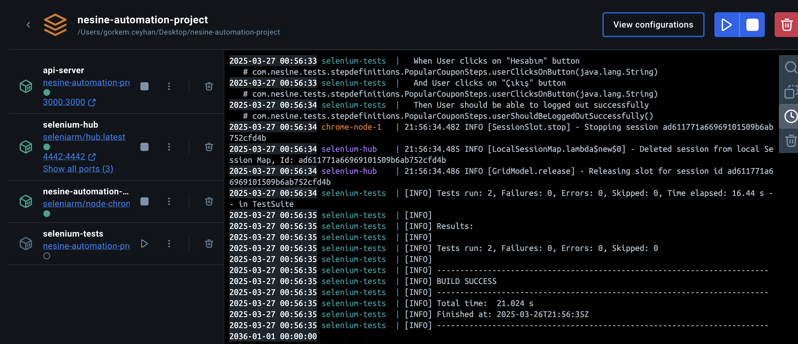
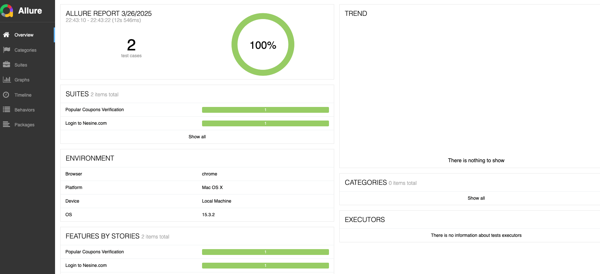
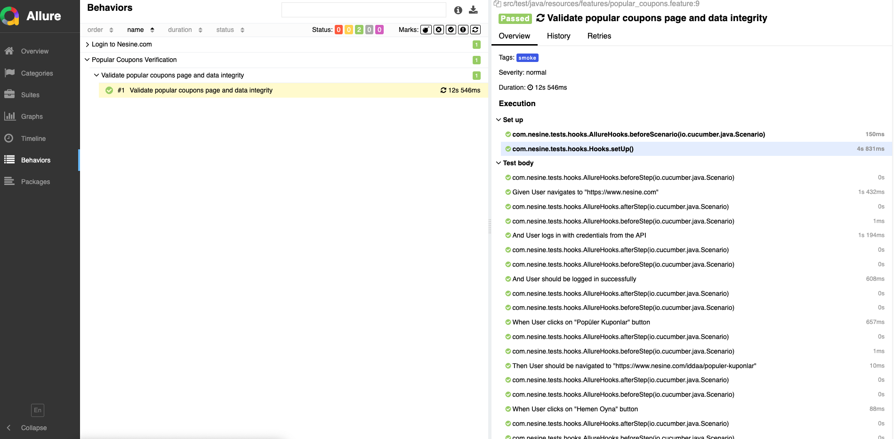

# Nesine Automation Project

This project automates test scenarios for the [nesine.com] web application using Node, Selenium, Java, Cucumber, TestNG, Maven, and Docker with Selenium Grid support.

---

## 📌 Project Overview

The automation suite includes:

- Logging into nesine.com by fetching credentials dynamically via an API server.
- Verifying popular coupons and ensuring data integrity between API responses and the UI.
- Parallel test execution using Selenium Grid within Docker.
- Detailed test reporting using Allure Reports.

---

## ⚙️ Technologies Used

- **Node.js** (API creation)
- **Selenium WebDriver** (Browser automation)
- **Java** (Programming language)
- **Cucumber** (BDD test framework)
- **TestNG** (Test runner)
- **Maven** (Dependency management)
- **Docker & Docker Compose** (Containerization)
- **Selenium Grid** (Parallel test execution)
- **Allure Reports** (Advanced test reporting)
- **Rest-Assured** (API testing)
- **log4j2** (Logging)

---

## 🚀 Installation & Execution Steps

Follow the steps below to set up and run the tests:

### Prerequisites

- [Docker](https://docs.docker.com/get-docker/)
- [Docker Compose](https://docs.docker.com/compose/install/)

### 1️⃣ Clone the Repository

```bash
git clone https://github.com/Adyalii/nesine-automation-node.git
cd nesine-automation-node
```

### 2️⃣ Configure Credentials

Edit the file located at `api-server/credentials.txt`:

```text
username=your_actual_username
password=your_actual_password
```

Replace placeholders with your actual credentials.

### 3️⃣ Build & Run the Project

Execute the following commands in your terminal:

```bash
docker-compose build
docker-compose up
```

This will:
- Start the API server.
- Start Selenium Grid (Hub and Chrome Node).
- Execute Selenium tests in parallel.

---

## 📊 Accessing Test Reports (Allure)

After tests execution, reports will be generated in `./reports/allure-results`.

To view the Allure Report, run:

```bash
allure serve ./reports/allure-results
```

Ensure Allure is installed ([installation guide](https://docs.qameta.io/allure/#_installing_a_commandline)).

---

## 📸 Screenshots of Successful Execution





---

## ⚠️ Important Notes

- The API server credentials must be updated with your actual account details to avoid authentication errors.
